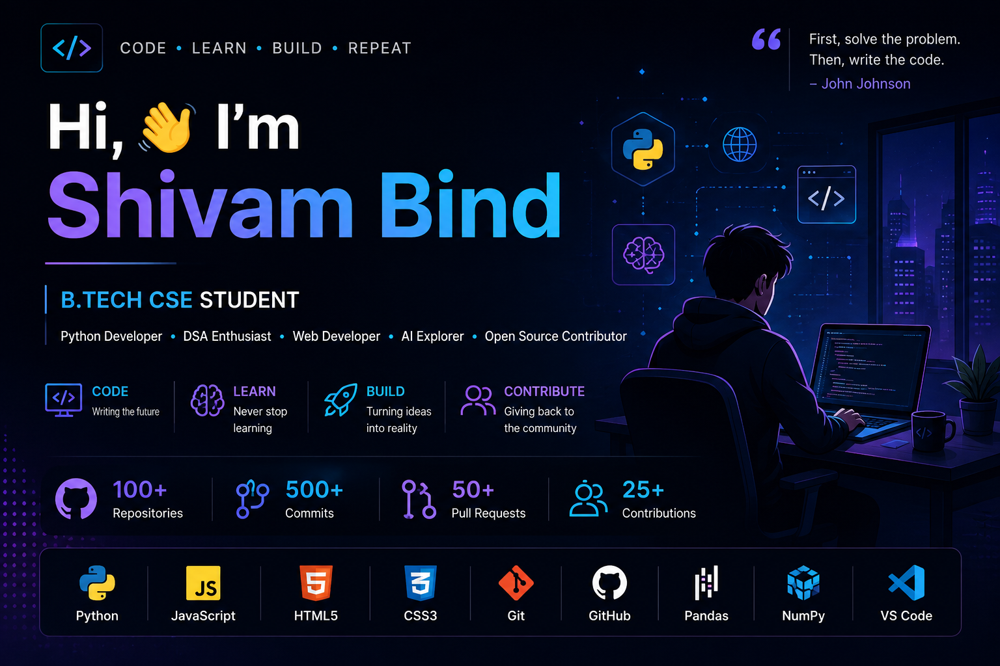

<div align="center">



</div>

<br>

# 👋 Hi, I'm Shivam Bind

<div align="center">

### 💻 B.Tech CSE Student • Python Developer • Open Source Contributor

**Code • Learn • Build • Contribute 🚀**

</div>

---

## 🧑‍💻 About Me

I'm a **Computer Science Engineering student** who enjoys turning ideas into practical software.

I'm currently focused on **Python, Data Structures & Algorithms, Web Development, AI, and Open Source**.

* 🎓 B.Tech CSE Student
* 🐍 Python Developer
* 🧠 DSA Learner
* 🌐 Web Development Enthusiast
* 🤖 Exploring AI & AI Agents
* 📊 Interested in Data Analysis
* 🌍 Open Source Contributor
* 🚀 Building real-world projects
* 📚 Always learning something new

---

## 🛠️ Tech Stack

### 💻 Languages

<p>

</p>

### 🔧 Tools & Technologies

<p>

</p>

### 📊 Data & Libraries

<p>


</p>

---

## 🚀 Featured Projects

### 📊 Student Grade Analyzer

A Python and Pandas based application for analyzing student academic performance.

**Features**

* 📁 CSV data processing
* 🧹 Data cleaning
* 🔢 Grade calculation
* 🏆 Student ranking
* 📊 Subject-wise analysis
* 📈 Attendance analysis
* ⚠️ At-risk student detection
* 📑 Excel report generation

**Built with:** `Python` `Pandas` `OpenPyXL` `Flask`

---

### 🌱 EcoWorld

An environmental awareness website designed to promote awareness about environmental issues and sustainable living.

**Built with:** `HTML` `CSS` `JavaScript`

---

### 🎨 EaseMotion CSS Contributions

Contributing UI and CSS components to an open-source animation/component project.

Areas of contribution include:

* ✨ CSS animations
* 🎨 UI components
* 🖱️ Interactive effects
* 📱 Responsive designs
* 🌐 Front-end examples

---

## 🌍 Open Source

I enjoy contributing to open-source projects because it gives me the opportunity to:

```text
Learn from real projects
        ↓
Understand production code
        ↓
Build new features
        ↓
Create Pull Requests
        ↓
Receive feedback
        ↓
Become a better developer
```

### 🔥 Areas I Contribute In

* 🎨 Frontend components
* CSS animations
* UI/UX improvements
* Documentation
* Bug fixes
* New examples
* Developer tools

---

## 🧠 DSA & Problem Solving

Currently improving my problem-solving skills through programming practice.

### Topics I'm Working On

```text
Arrays
Strings
Searching
Sorting
Recursion
Hashing
Prefix Sum
Stack
Queue
Time Complexity
Dynamic Programming
Graphs
```

### 🎯 Goal

> Become a strong problem solver who can understand a problem, design an efficient solution, and implement it cleanly.

---

## 🤖 Currently Exploring

I'm currently interested in:

* 🤖 Artificial Intelligence
* 🧠 AI Agents
* 🔗 LLM Applications
* ⚙️ Automation
* 🌐 APIs
* 📊 Data Analysis
* 💻 Backend Development

---

## 📈 GitHub Activity

<div align="center">

<a href="https://github.com/shivambind269-ai">
  
</a>

<a href="https://github.com/shivambind269-ai">
  
</a>

</div>
---

## 🔥 Contribution Streak

<div align="center">


</div>

---

## 🌱 Coding Journey

<div align="center">

**LEARN** 🧠 → **BUILD** 🛠️ → **CONTRIBUTE** 🌍 → **GROW** 🚀

</div>

---

## 📊 Contribution Graph

<div align="center">


</div>


---

## 🎯 My 2026 Goals

* [ ] 🧠 Become stronger in DSA
* [ ] 🐍 Improve advanced Python
* [ ] 🌐 Build better web applications
* [ ] 🤖 Learn AI/ML
* [ ] 🧩 Build AI-powered applications
* [ ] 🌍 Make meaningful open-source contributions
* [ ] 🏗️ Build more real-world projects
* [ ] 🏆 Participate in hackathons
* [ ] 💼 Build a strong developer portfolio

---

## 📚 Learning Journey

<div align="center">

### LEARN → BUILD → CONTRIBUTE → IMPROVE

</div>

I'm a firm believer that the best way to learn development is by **building projects and contributing to real codebases**.

Every project teaches me something new.

Every bug makes me better.

Every contribution helps me grow.

---

## 💡 Developer Mindset

```text
                    THINK
                      ↓
                   LEARN
                      ↓
                   BUILD
                      ↓
                   TEST
                      ↓
                 IMPROVE
                      ↓
                CONTRIBUTE
                      ↓
                    REPEAT
```

---

## 📫 Let's Connect

<div align="center">

<a href="https://github.com/shivambind269-ai">

</a>

<!-- Replace this with your actual LinkedIn URL -->

<a href="YOUR_LINKEDIN_URL">

</a>

<!-- Replace this with your portfolio URL if you have one -->

<a href="YOUR_PORTFOLIO_URL">

</a>

</div>

---

<div align="center">

### ⭐ Thanks for visiting my profile!

**Keep Learning • Keep Building • Keep Contributing 🚀**

</div>
